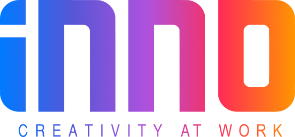

# INNO CV Parser Tool Web Application

[Link](#link) ✦ [Features](#features) ✦ [Use Cases](#use-cases) ✦ [License](#license)

**System for Knowledge Identification & Management.**
A powerful web application designed to streamline the process of extracting structured data from unstructured documents (PDF, DOCX) and seamlessly uploading it to Google Sheets.

INNO CVPT is specifically optimized for **Recruitment** workflows, featuring intelligent candidate filtering based on Job Descriptions (JD).

 

    

> [!IMPORTANT]
> **Agentic Document Extraction (ADE)**: CVPT leverages advanced AI from LandingAI to allow users to define custom data schemas. This ensures highly accurate and tailored data extraction for various use cases, from CV parsing to invoice processing.

## 🌟 Features

CVPT is built to make data extraction effortless and efficient. Here are the key capabilities:

-   **🧠 Agentic Document Extraction (ADE):** Utilizes LandingAI's sophisticated AI to "read" and understand documents like a human, extracting information based on your defined schema.
-   **🎯 Smart Candidate Filtering:**
    -   Automatically filters out CVs that do not meet Job Description (JD) requirements.
    -   Supports filtering by: **Years of Experience** (Min/Max) and **University** (Preferred/Excluded).
    -   Users can create, edit, and delete JD filters directly within the app.
-   **⚙️ Flexible Schema Customization:**
    -   Define exactly what data needs to be extracted (e.g., "Candidate Name", "Skills", "Recent Projects").
    -   Easily Add, Edit, or Remove fields via an intuitive GUI.
-   **📂 Configuration Import/Export:** Easily share filter sets and schemas with colleagues via `.json` files without exposing sensitive information like API Keys.
-   **📊 Google Sheets Integration:** Automatically uploads extracted and filtered data to a specified Google Sheet, organized into columns matching your schema.
-   **📄 Multi-Format Support:** Process both **PDF** and **DOCX** files seamlessly.
-   **💸 Credit Cost Optimization:** Automatically detects and splits PDF files (processing only the first few pages containing key info) to save AI credits when handling applications with long portfolios.
-   **🖥️ Intuitive User Interface:** A clean and easy-to-use desktop application built with Tkinter.

## 🔭 Use Cases

CVPT is versatile and can be adapted for various industries:

| Use Case | Description |
| :--- | :--- |
| **CV Parsing & Filtering** | **(Primary)** Automatically extract candidate details from batches of CVs. Filter out candidates matching specific recruitment criteria (Experience, Education) before pushing valid profiles to the management system.  |
| **Invoice Processing** | Automate data entry for invoice numbers, dates, line items, and totals from scanned or PDF invoices. |
| **Project Data Collection** | Extract specific project details (contractor, scope, investor) from capability profiles or reports.  |
| **Research Data Aggregation** | Automatically collect specific data points from academic papers or market reports.  |

## 🔰 Getting Started

### 💻 Prerequisites

Before you begin, ensure you have the following:

| Component | Requirement |
| :--- | :--- |
| **Python** | Version 3.8+ installed on your system.  |
| **Google Cloud** | A Project with **Sheets API** & **Drive API** enabled. You need the `credentials.json` file (OAuth 2.0 Client ID).  |
| **LandingAI** | A LandingAI account and **API Key** for the extraction service.  |

## 🕹 Usage

### Configuration and Running

1.  **Preparation:** Prepare your LandingAI API Settings.

2.  **Workflow:**
    * **Step 1: Login:** Click "Login to Google" to authorize write access to your Sheet.
    * **Step 2: Select Files:** Choose one or multiple CV files (PDF/DOCX.
    * **Step 3: Process AI (ADE):** Click "Process ADE" to let the AI analyze the documents.
    * **Step 4: Filter & Upload:**
        * Select a Job Position (Filter) from the dropdown menu (e.g., "Structural Engineer").
        * Click "Filter & Upload". The system will automatically reject candidates who don't meet the criteria and upload only "PASS" candidates to Google Sheets.

3.  **Advanced Management:**
    * **⚙️ Schema:** Open to add/remove data fields you want the AI to extract.
    * **⚙️ Filters (Gear Icon):** Open to create new Job Positions with specific filtering criteria (Experience range, Target Universities).
    * **File Menu:** Use **Import/Export Config** to backup or share your filters and schemas with colleagues.

## 🧾 License

This project is open-source and available under the [MIT License](LICENSE).****
